<b>🇺🇸 English</b>

  

  | 💾 **Databases** |   |
  | :------------: | :------------: |
  |  **Python** |     |
  |  **JavaScript** |     |
  |  **Deployment** |    |
  |  **Mathematics** | School curriculum, mathematical analysis, linear algebra, mathematical statistics, topology, combinatorics |
  |  |  |
  |  **I use** |           |

 
<b>🇷🇺 Русский</b>

  

  |   💾 **Базы данных**  |      |
  | :------------: | :------------: |
  |    **Python** |     |
  |   **JavaScript**  |         |
  |   **Деплой** |     |
  |   **Математика** |  Школьный курс, математический анализ, линейная алгебра, математическая статистика, топология, комбинаторика |
  |   |   |
  |   **Я  использую**  |            |

